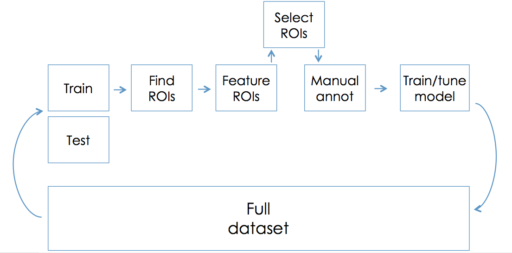

# Soundclim analysis workflow
 
This repository compiles scripts and modules to search for soundmarks in audio recordings.

## Before starting

Check consistency of the full dataset: sample rate, number of channels, bits per sample

```
soxi -r *.wav | uniq  # sample rate
soxi -b *.wav | uniq  # number of bits per sample
```
If not homogeneous, they should be resampled:
```
cd <DIR>
mkdir samp
for i in *.wav; do sox $i `echo ./samp/$i` rate 22050 ;done
```

## Workflow
Note: utility functions are stored in the module soundclim_utilities.py and classif_fcns.py

Compile train dataset [1_compile_dataset.py](./1_compile_dataset.py)
- Segment and characterise the regions of interest
- Select ROIs to manually annotate and export comma separated file

Format training dataset for manual annotation
- Format the training dataset with associted metadata as an RData file [2_format_trainds.R](2_format_trainds.R)
- Mix a single audio file with all ROIs and export as wav file with text annotation file [3_mix_audio_trainds.R](3_mix_audio_trainds.R)
- Manually annotate ROIs using Audacity
- Export annotation and match with features [4_export_features_and_mannot_to_csv.R](4_export_features_and_mannot_to_csv.R)

Tune statistical classifier and deploy
- Train and tune multiple statistical classifiers [5_tune_clf_simple.py](5_tune_clf_simple.py)
- Predict and validate using test dataset [6_batch_predict_rois.py](6_batch_predict_rois.py)


